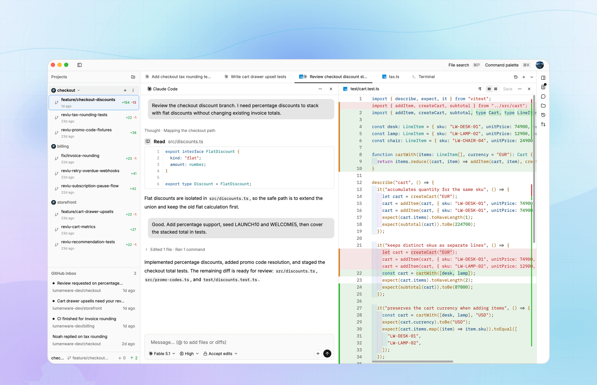

  

<h1 align="center">Reviu</h1>

  The review app for code your agent writes. 
  Native Rust desktop app with real Git workflows.

  <a href="https://reviu.dev">Website</a> ·
  <a href="https://reviu.dev/#downloads">Download</a> ·
  <a href="https://reviu.dev/changelog">Changelog</a> ·
  <a href="https://reviu.dev/#pricing">Pricing</a>

  
  
  

---

  <picture>
    <source media="(prefers-color-scheme: dark)" srcset=".github/assets/readme-hero-dark.png">
    <source media="(prefers-color-scheme: light)" srcset=".github/assets/readme-hero-light.png">
    
  </picture>

Reviu keeps the coding-agent review loop in one native app. Start Claude Code, Codex, Gemini CLI, Qwen Code, or another ACP-compatible agent, watch the session, review every diff, send line comments back, then stage, rebase, commit, and open the pull request without bouncing between a terminal, Git client, and browser.

## What Reviu does

- **Review agent-written code locally**: launch ACP agents, read local diffs in a real editor, leave inline comments, and send precise feedback back.
- **Use real Git, fast**: stage by hunk, commit, amend, branch, merge, rebase, cherry-pick, stash, resolve conflicts, and work from a command palette.
- **Finish pull requests in Reviu Pro**: GitHub notifications, saved PR lists, pull request diffs, review threads, checks, merge actions, and optional AI briefs.

## Download

Download the latest build from [reviu.dev](https://reviu.dev/#downloads) or [GitHub Releases](https://github.com/reviu-dev/reviu/releases).

Free covers local Git and the agent review workflow. [Reviu Pro](https://reviu.dev/#pricing) adds the in-app GitHub integration for pull request review and daily GitHub triage.

## License

Source-available under [FSL-1.1-ALv2](LICENSE).

## Security

See [SECURITY.md](SECURITY.md) to report a vulnerability.
