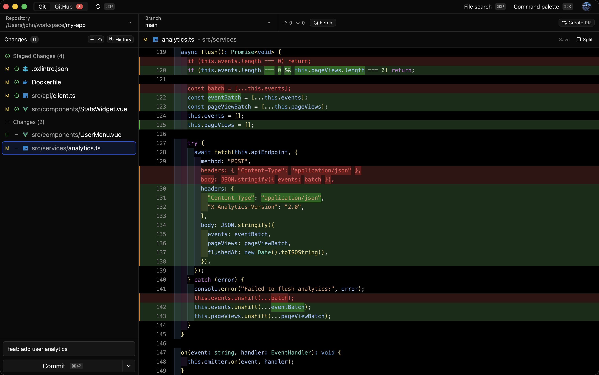
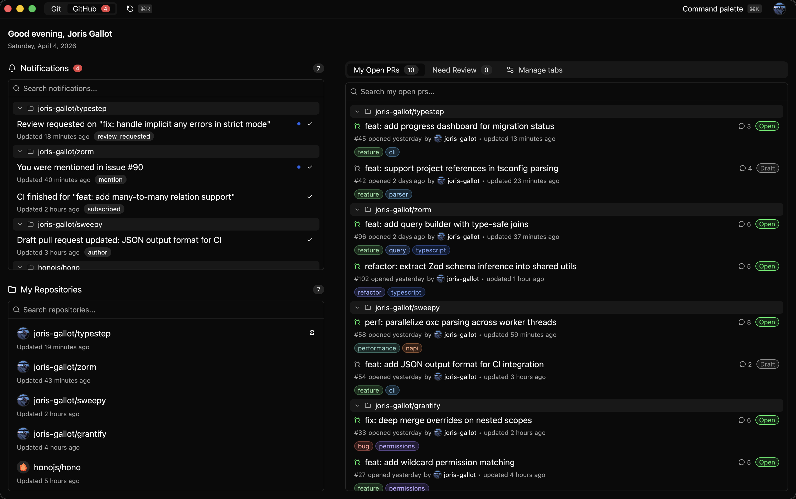
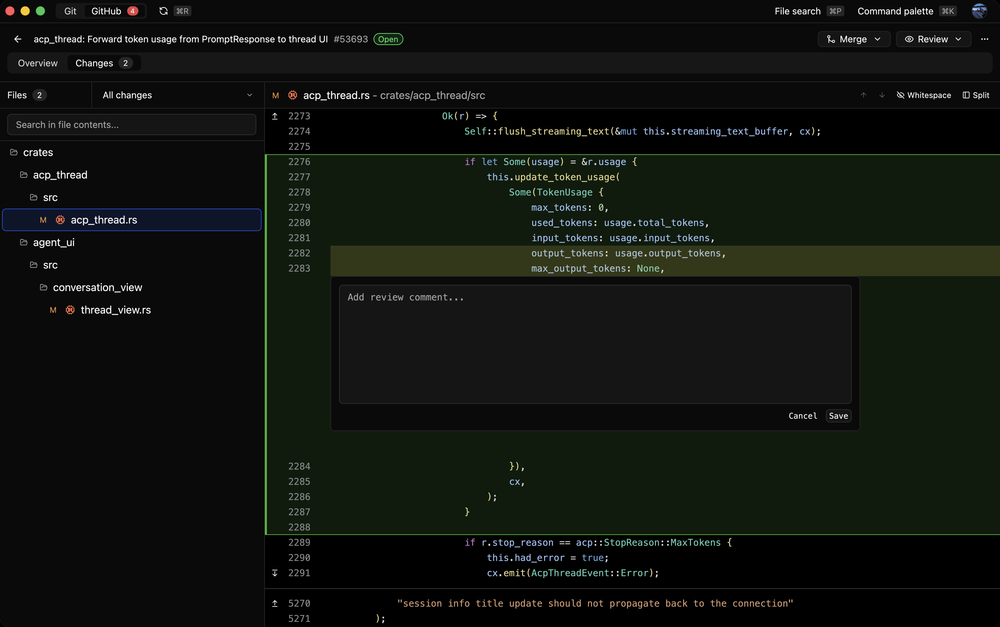
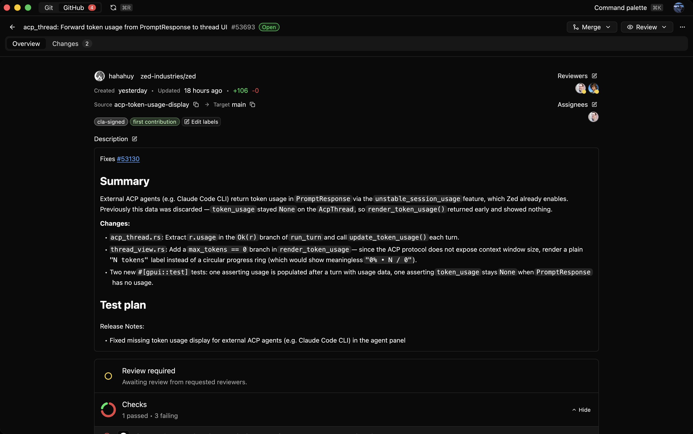

# Reviu

A keyboard-first desktop Git client, built in Rust with [GPUI](https://gpui.rs). Review your AI agent's code before you push, then take it to merge.

**[Website](https://reviu.dev)** · [Download](https://reviu.dev/#downloads) · [Changelog](https://reviu.dev/changelog)

Reviu keeps the whole review loop in one native app: read your local diffs, review the code your agent wrote, and (with Reviu Pro) do GitHub pull request review, instead of bouncing between a Git client, the terminal and the browser. No Electron, no webview.

<picture>
  <source media="(prefers-color-scheme: light)" srcset="landing/src/assets/app_screenshots/git_light.png">
  
</picture>

## Features

### Review your agent's code before you push

Run Claude or Codex from the sidebar, read the diff it produced in a real editor, leave inline comments on the lines you want changed, and send them back to the agent. Works on local changes, no account needed.

### Full local Git, keyboard-first

Inline and split diffs, staging by hunk, commit / amend / undo, branch, merge, rebase (including interactive), cherry-pick, stash and conflict resolution, all reachable from a command palette. A built-in terminal sits beside the diff and opens in the selected repo.

### A GitHub home built for daily review · Reviu Pro

Notifications, saved pull request lists with filters, and repository browsing in one desktop home, backed by a multi-tier cache so it stays fast.

<picture>
  <source media="(prefers-color-scheme: light)" srcset="landing/src/assets/app_screenshots/github_home_light.png">
  
</picture>

### Pull request review on the desktop · Reviu Pro

Open a PR in inline or split diff, comment on the exact lines, stack comments into a pending review and submit them together (Approve / Request changes / Comment), track checks, and merge when the branch is ready.

<picture>
  <source media="(prefers-color-scheme: light)" srcset="landing/src/assets/app_screenshots/github_pr_changes_light.png">
  
</picture>

### Threads, replies and AI briefs · Reviu Pro

Reply to review threads, resolve conversations, and get an optional AI brief of a pull request (summary, files to review first, risks) with your own OpenAI or Anthropic key.

<picture>
  <source media="(prefers-color-scheme: light)" srcset="landing/src/assets/app_screenshots/github_pr_conv_light.png">
  
</picture>

## Reviu Pro

Free covers local Git and the agent panel. Reviu Pro adds the in-app GitHub integration (notifications, repository browsing, pull request review, issues, checks and merge actions) for `$9/month` or `$79/year`, with a 14-day trial.

## Repository layout

- `desktop/`: the Rust + GPUI desktop app (this is the client).
- `landing/`: the Astro marketing site ([reviu.dev](https://reviu.dev)).
- `extension/`: browser extension for GitHub repos, PRs, and issues.

The GitHub-integration backend (the service powering Reviu Pro) is closed-source and lives in a separate private repository. The Free features (local Git and the agent panel) run fully without it.

## License

Source-available under [FSL-1.1-ALv2](LICENSE) (Functional Source License, Apache 2.0 future license): use, modify and redistribute freely for any non-competing purpose; each version converts to Apache-2.0 two years after its release.

## Security

See [SECURITY.md](SECURITY.md) to report a vulnerability.
